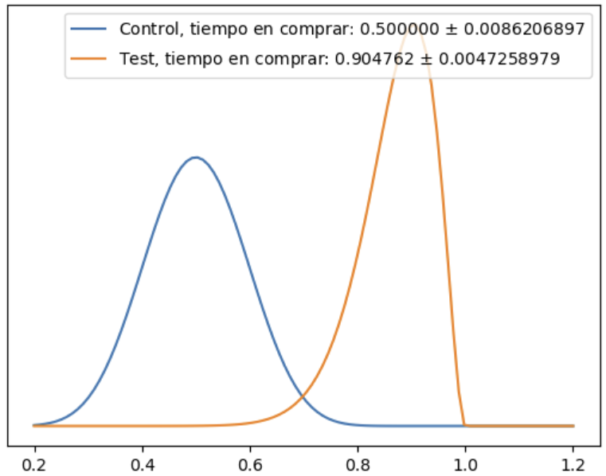

# Nunez-De-Balboa-AB-Testing

# Objetivo principal

En el siguiente proyecto se busca realizar un CRO de la página web de un ecommerce a través de AB testing.

# Proceso del proyecto a nivel general

El proceso se divide en los siguientes pasos:

- Modificación de una versión "standard" de la web de forma que tengamos dos modelos.
- Testeo de las dos versiones por separado y a individuos distintos midiendo, en nuestro caso, el tiempo de conversión en ambas webs.
- Almacenamiento de los datos.
- Tratamiento y análisis de los mismos en Pandas realizando el AB Testing.
- Selección de la mejor versión en base a las conclusiones y presentación del proyecto.[^1]

# Gráfica resultante y conclusiones

Vista la gráfica resultante de hacer el AB testing concluimos que la nueva versión, dado el desplazamiento de la normal hacia la derecha, tenía un mejor rendimiento en términos de tiempo de conversión. Más concretamente, como se detalla en la presentación y en el código la mejora fue de aproximadamente el 73% con una probabilidad del 99%

[^1]: https://www.figma.com/proto/usZ7aqxdLatNzm5V3qzs6E/PROJECT-2---NU%C3%91EZ-DE-BALBOA?type=design&node-id=1119-8002&scaling=min-zoom&page-id=1119%3A7923
